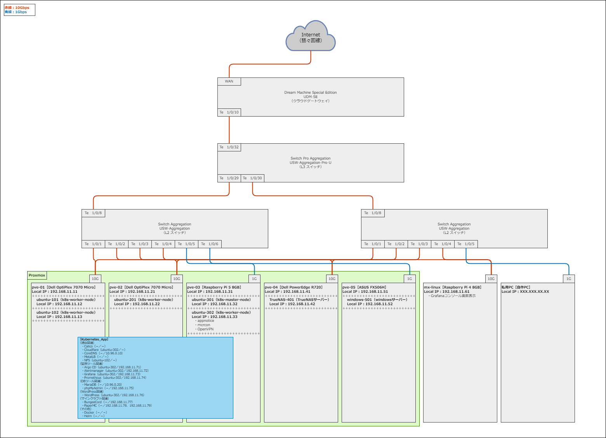

**各操作マニュアル**
---
**【ネットワーク図】**<br>
<br>
<details>
<summary>「Linux」操作マニュアル<br></summary>
<details>
<summary>∟【事前準備】<br></summary>

０１.[Discord ウェブフック](https://qiita.com/tmasuyama/items/9e37e89a9fd858e4df37)導入<br>

０２.[TereTerm](https://ja.osdn.net/projects/ttssh2/releases/)導入<br>

０３.[Cloudflare](https://www.cloudflare.com/ja-jp/)導入<br>

０４.Apps Script、スプレッドシート導入<br>
</details>

<details>
<summary>∟【Rasberry Pi設定】<br></summary>
<details>
<summary>　∟【Node側設定】<br></summary>

０１.[Raspberry Pi Imager](https://www.raspberrypi.com/software/)よりRaspberry Pi OS Liteをインストール（Windows側操作）<br>

０２.[pimox](https://immedeep.com/raspi-proxmox/710/)導入（Linux側操作）<br>
```
sudo apt update && sudo apt upgrade -y
sudo apt install -y curl
nmcli connection show
nmcli connection show 'Wired connection 1'
sudo nmcli connection modify 'Wired connection 1' connection.id eth0
nmcli connection show eth0
sudo nmcli connection modify eth0 ipv4.addresses 任意のIPアドレス（★①）/24
sudo nmcli connection modify eth0 ipv4.gateway 192.168.11.1
sudo nmcli connection modify eth0 ipv4.dns 10.96.0.10,192.168.11.1
sudo nmcli connection modify eth0 ipv4.method manual
nmcli -f ipv4 connection show eth0
sudo reboot
ip a | grep ★①
以下を確認
+++++++++++++++++++++++++++++++++++++++++++++++++++++++++++++++++++++
inet ★①/24 brd 192.168.11.255 scope global noprefixroute eth0
+++++++++++++++++++++++++++++++++++++++++++++++++++++++++++++++++++++
sudo nano /etc/hosts
以下を設定
+++++++++++++++++++++++++++++++++++++++++++++++++++++++++++++++++++++
★① pve-03
+++++++++++++++++++++++++++++++++++++++++++++++++++++++++++++++++++++
hostname --ip-address
以下を確認
+++++++++++++++++++++++++++++++++++++++++++++++++++++++++++++++++++++
★①
+++++++++++++++++++++++++++++++++++++++++++++++++++++++++++++++++++++
sudo passwd root
任意のパスワードを設定
sudo -s
echo 'deb [arch=arm64] https://mirrors.apqa.cn/proxmox/debian/pve bookworm port'>/etc/apt/sources.list.d/pveport.list
curl https://mirrors.apqa.cn/proxmox/debian/pveport.gpg -o /etc/apt/trusted.gpg.d/pveport.gpg
apt update && apt upgrade -y
apt install -y ifupdown2
apt install -y proxmox-ve postfix open-iscsi
「Local only」→「pve-03」→「Enter」押下
reboot
「https://★①:8006」へ入る
以下はRaspberry Pi上のブート順序を変更する場合に実施
+++++++++++++++++++++++++++++++++++++++++++++++++++++++++++++++++++++
sudo rpi-eeprom-config --edit
BOOT_ORDER=0xf416（←SSDへのブート時）
BOOT_ORDER=0xf41（←microSDへのブート時）
sudo reboot
+++++++++++++++++++++++++++++++++++++++++++++++++++++++++++++++++++++
```

０３.初期設定（Windows_Proxmox側操作）<br>
```
「データセンター」→「pve-XX」→「システム」→「ネットワーク」
「作成」→「Linux Bridge」
以下を設定
+++++++++++++++++++++++++++++++++++++++++++++++++++++++++++++++++++++
名前：vmbr0
IPv4/CIDR：★①/24
ゲートウェイ(IPv4)：192.168.11.1
自動起動：チェック
ブリッジポート：eth0
+++++++++++++++++++++++++++++++++++++++++++++++++++++++++++++++++++++
sudo reboot
sudo apt update && sudo apt upgrade -y
sudo raspi-config
「3 Interface Options」→「I1 SSH」→「YES」押下
「5 Localisation Options」→「L2 Timezone」→「Asia」→「Tokyo」押下
「5 Localisation Options」→「L3 Keyboard」→「Generic 105-key PC」→「Japanese」→「The default～」
  →「No compose key」押下
Finish
date
cd /etc/ssh
ls -l sshd_config
sudo nano sshd_config
以下を設定
+++++++++++++++++++++++++++++++++++++++++++++++++++++++++++++++++++++
PermitRootLogin no
+++++++++++++++++++++++++++++++++++++++++++++++++++++++++++++++++++++
sudo /etc/init.d/ssh restart
sudo systemctl stop dphys-swapfile
sudo systemctl disable dphys-swapfile
sudo apt install -y snapd
sudo snap install yq
```

０４.PCケース設定（Windows_TereTerm側操作）<br>
```
Argon系のPCケース使用時は手順書の設定を実施
sudo reboot
```

０５.ufw導入（Windows_TereTerm側操作）<br>
```
sudo apt install -y ufw
sudo ufw default deny
sudo ufw allow 22
sudo ufw allow 179
sudo ufw allow 2049
sudo ufw allow 6443
sudo ufw allow 8006
sudo ufw allow 9100
sudo ufw allow 10250
sudo ufw enable
sudo ufw status
```
</details>

<details>
<summary>　∟【VM側設定】<br></summary>

０１.VM作成（Windows_Proxmox側操作）<br>
</details>
</details>

<details>
<summary>∟【Rasberry Pi以外設定】<br></summary>
<details>
<summary>　∟【Node側設定】<br></summary>

０１.[Proxmox](https://www.proxmox.com/en/downloads/category/iso-images-pve)導入（Linux側操作）<br>
```
以下を設定
+++++++++++++++++++++++++++++++++++++++++++++++++++++++++++++++++++++
Install Proxmox VE（Graphical）を選択
Country：Japan
Time zone：Asia/Tokyo
Keyboard Layout：Japanese
Password：任意のパスワード
Email：任意のメールアドレス
Management Interface：複数nicある場合、管理IPにしたいnic
Hostname (FQDN)：pve-XX.local
IP Address (CIDR)：任意のIPアドレス（★②）/24
Gateway：192.168.11.1
DNS Server：10.96.0.10
+++++++++++++++++++++++++++++++++++++++++++++++++++++++++++++++++++++
useradd -m -s /bin/bash pve-XX
usermod -aG sudo pve-XX
passwd pve-XX
ノートPC時の場合は以下を設定
+++++++++++++++++++++++++++++++++++++++++++++++++++++++++++++++++++++
nano /etc/systemd/logind.conf
「HandleLidSwitch=ignore」へ編集
systemctl mask sleep.target suspend.target hibernate.target hybrid-sleep.target
systemctl restart systemd-logind
+++++++++++++++++++++++++++++++++++++++++++++++++++++++++++++++++++++
GPU使用時は以下を設定
+++++++++++++++++++++++++++++++++++++++++++++++++++++++++++++++++++++
nano /etc/default/grub
「GRUB_CMDLINE_LINUX_DEFAUTL」に「intel_iommu=on」を追加
apt update && apt upgrade -y
apt install -y libgl1 libegl1
+++++++++++++++++++++++++++++++++++++++++++++++++++++++++++++++++++++
「https://★②:8006」へ入る
```

０２.初期設定（Windows_Proxmox側操作）<br>
```
「データセンター」→「pve-XX」→「システム」→「DNS」→「編集」→「DNS サーバ 2：192.168.11.1」→「OK」押下
「データセンター」→「pve-XX」→「アップデート」→「リポジトリ」→「～/debian/pve」→「disable」押下
「データセンター」→「pve-XX」→「アップデート」→「リポジトリ」→「～/debian/ceph-quincy」→「disable」押下
「データセンター」→「pve-XX」→「アップデート」→「リポジトリ」→「追加」→「No-Subscription」→「追加」押下
「データセンター」→「pve-XX」→「アップデート」→「リポジトリ」→「追加」→「Ceph Quincy No-Subscription」→「追加」押下
reboot
apt update && apt upgrade -y
apt install -y sudo
sudo apt update && sudo apt upgrade -y
sudo dpkg-reconfigure keyboard-configuration
以下を設定
+++++++++++++++++++++++++++++++++++++++++++++++++++++++++++++++++++++
「Generic 105-key PC (intl.) 」
「Japanese」
「Japanese」
「The default for the keyboard layout 」
「No compose key」
+++++++++++++++++++++++++++++++++++++++++++++++++++++++++++++++++++++
sudo timedatectl set-timezone Asia/Tokyo
timedatectl
date
cd /etc/ssh
ls -l sshd_config
sudo nano sshd_config
以下を設定
+++++++++++++++++++++++++++++++++++++++++++++++++++++++++++++++++++++
PermitRootLogin no
+++++++++++++++++++++++++++++++++++++++++++++++++++++++++++++++++++++
sudo /etc/init.d/ssh restart
sudo nano /etc/fstab
以下を設定
+++++++++++++++++++++++++++++++++++++++++++++++++++++++++++++++++++++
swap箇所をコメントアウト
+++++++++++++++++++++++++++++++++++++++++++++++++++++++++++++++++++++
ip a
ipアドレス（★③）を控える
sudo apt install -y snapd
sudo snap install yq
```

０３.IPアドレス固定（Windows_TereTerm側操作）<br>
```
su -
cd /etc/network
ls -l interfaces
sudo nano interfaces
以下を設定
+++++++++++++++++++++++++++++++++++++++++++++++++++++++++++++++++++++
adress ★③/24
gateway 192.168.11.1
+++++++++++++++++++++++++++++++++++++++++++++++++++++++++++++++++++++
exit
```

０４.ufw導入（Windows_TereTerm側操作）<br>
```
sudo apt install -y ufw
sudo ufw default deny
sudo ufw allow 22
sudo ufw allow 179
sudo ufw allow 2049
sudo ufw allow 6443
sudo ufw allow 8006
sudo ufw allow 9100
sudo ufw allow 10250
sudo ufw enable
sudo ufw status
```

０５.クラスタ作成（Windows_Proxmox側操作）<br>
```
「データセンター」→「クラスタ」→「クラスタを作成」押下
以下を設定
+++++++++++++++++++++++++++++++++++++++++++++++++++++++++++++++++++++
pve-cluster
+++++++++++++++++++++++++++++++++++++++++++++++++++++++++++++++++++++
「作成」押下
```

０６.クラスタ参加（Windows_Proxmox側操作）<br>
```
「データセンター」→「クラスタ」→「クラスタに参加」→「join情報」を入力→「パスワード」を入力→「Join 'pve-cluster'」押下
```
</details>

<details>
<summary>　∟【VM側設定】<br></summary>

０１.VM作成（Windows_Proxmox側操作）<br>

０２.TrueNAS設定（Windows_Proxmox側操作）<br>
```
VM起動前に以下を実施
sudo find /dev/disk/by-id/ -type l|xargs -I{} ls -l {}|grep -v -E '[0-9]$' |sort -k11|cut -d' ' -f9,10,11,12
scsi内容を控える
以下を設定
+++++++++++++++++++++++++++++++++++++++++++++++++++++++++++++++++++++
sudo qm set VM番号 -scsi1 /dev/disk/by-id/ata内容
sudo qm set VM番号 -scsi2 /dev/disk/by-id/ata内容
sudo qm set VM番号 -scsi3 /dev/disk/by-id/ata内容
sudo qm set VM番号 -scsi4 /dev/disk/by-id/ata内容
sudo qm set VM番号 -scsi5 /dev/disk/by-id/ata内容
sudo qm set VM番号 -scsi6 /dev/disk/by-id/ata内容
sudo qm set VM番号 -scsi7 /dev/disk/by-id/ata内容
sudo qm set VM番号 -scsi8 /dev/disk/by-id/ata内容
+++++++++++++++++++++++++++++++++++++++++++++++++++++++++++++++++++++
「データセンター」→「pve-XX」→「VM」→「ハードウェア」→「各追加ハードディスク」押下
以下を設定
+++++++++++++++++++++++++++++++++++++++++++++++++++++++++++++++++++++
バックアップ：チェック外す
複製をスキップ：チェック
+++++++++++++++++++++++++++++++++++++++++++++++++++++++++++++++++++++
VMを起動
以下を設定
+++++++++++++++++++++++++++++++++++++++++++++++++++++++++++++++++++++
Enter
1
インストール先を選択（space）
Yes
1
パスワードを入力
No swap
OK
Reboot System
+++++++++++++++++++++++++++++++++++++++++++++++++++++++++++++++++++++
以下を設定
+++++++++++++++++++++++++++++++++++++++++++++++++++++++++++++++++++++
Enter an option from 1-11：1
Enter
ipv4_dhcp：No
aliases：192.168.11.XX/24
Save
Select an interface (q to quit)：a
Select an interface (q to quit)：p
Select an interface (q to quit)：q
Enter an option from 1-11：2
ipv4gateway：192.168.11.1
namesarver1：10.96.0.10
namesarver2：192.168.11.1
Save
Enter an option from 1-11：8
+++++++++++++++++++++++++++++++++++++++++++++++++++++++++++++++++++++
下記へアクセス
+++++++++++++++++++++++++++++++++++++++++++++++++++++++++++++++++++++
http://192.168.11.XX:8006
（ユーザー名：admin、PW：設定したパスワード）
+++++++++++++++++++++++++++++++++++++++++++++++++++++++++++++++++++++
「System Settings」→「General」→「Localization」→「Settings」→「Language」→「Japanese (ja)」
「Console Keyboard Map」→「Japanese (jp)」
「Timezone」→「Asia/Tokyo」
「SAVE」
「Credentials」→「Local Users」→「ADD」
以下を設定
+++++++++++++++++++++++++++++++++++++++++++++++++++++++++++++++++++++
フルネーム：任意の名前
ユーザー名：同上
Eメール：自分のメールアドレス
パスワード：任意のパスワード
保存
+++++++++++++++++++++++++++++++++++++++++++++++++++++++++++++++++++++
「ストレージ」→「プールの作成」
以下を設定
+++++++++++++++++++++++++++++++++++++++++++++++++++++++++++++++++++++
TrueNAS
暗号化チェック
確認チェック→I Understand
Next
Layout：任意のレイド
Disk Size：HDDの容量
Save And Go To Review
プールの作成
確認チェック→続ける
Download Encryption Key→Done
+++++++++++++++++++++++++++++++++++++++++++++++++++++++++++++++++++++
「Datesets」→「データセット」を追加
以下を設定
+++++++++++++++++++++++++++++++++++++++++++++++++++++++++++++++++++++
Name：share-01
Share Type：SMB
保存
+++++++++++++++++++++++++++++++++++++++++++++++++++++++++++++++++++++
「Shares」→「Windows (SMB)Shares」→「ADD」
以下を設定
+++++++++++++++++++++++++++++++++++++++++++++++++++++++++++++++++++++
Path：/mnt/TrueNAS/share-01/06-bk/Proxmox
名前：dump
保存
Enable～にチェック
Enable Service
+++++++++++++++++++++++++++++++++++++++++++++++++++++++++++++++++++++
「Date Protection」→「Periodic Snapshot タスク」→「Add」
以下を設定
+++++++++++++++++++++++++++++++++++++++++++++++++++++++++++++++++++++
データセット：TrueNAS/share-01
Snapshot Lifetime：1
Unit：Week
空のスナップショットの取得を許可する：チェック外す
保存
+++++++++++++++++++++++++++++++++++++++++++++++++++++++++++++++++++++
「Date Protection」→「Periodic S.M.A.R.T. Tests」→「Add」
以下を設定
+++++++++++++++++++++++++++++++++++++++++++++++++++++++++++++++++++++
全ディスク：チェック
Type：SHORT
スケジュール：Daily
保存
+++++++++++++++++++++++++++++++++++++++++++++++++++++++++++++++++++++
「System Settings」→「全般」→「Email」→「設定」→「GmailOAuthにチェック」
  →「Log In to Gmail Again」→「Proceed」→「保存」
「System Setting」→「サービス」→「S.M.A.R.T」及び「SMB」が動作中、自動的に起動に
  チェックがされているか確認
「System Settings」→「アラート設定」→「Emailの右端点々を押下」→「編集」
以下を設定
+++++++++++++++++++++++++++++++++++++++++++++++++++++++++++++++++++++
名前：E-mail
Enableにチェック
Type：E-mail
Lavel：警告
E-mail：自分のメールアドレス
保存
+++++++++++++++++++++++++++++++++++++++++++++++++++++++++++++++++++++
```
</details>
</details>

<details>
<summary>∟【共通設定】<br></summary>

０１.初期設定（Windows_Proxmox（Node、VM）側操作）<br>
```
sudo apt update && sudo apt upgrade -y
sudo dpkg-reconfigure keyboard-configuration
以下を設定
+++++++++++++++++++++++++++++++++++++++++++++++++++++++++++++++++++++
「Generic 105-key PC (intl.) 」
「Japanese」
「Japanese」
「The default for the keyboard layout 」
「No compose key」
+++++++++++++++++++++++++++++++++++++++++++++++++++++++++++++++++++++
sudo timedatectl set-timezone Asia/Tokyo
timedatectl
date
cd /etc/ssh
ls -l sshd_config
sudo nano sshd_config
以下を設定
+++++++++++++++++++++++++++++++++++++++++++++++++++++++++++++++++++++
PermitRootLogin no
+++++++++++++++++++++++++++++++++++++++++++++++++++++++++++++++++++++
sudo /etc/init.d/ssh restart
sudo nano /etc/fstab
以下を設定
+++++++++++++++++++++++++++++++++++++++++++++++++++++++++++++++++++++
swap箇所をコメントアウト
+++++++++++++++++++++++++++++++++++++++++++++++++++++++++++++++++++++
ip a
仮想NIC（★④）を控える
ipアドレス（★⑤）を控える
sudo snap install yq
以下を設定
+++++++++++++++++++++++++++++++++++++++++++++++++++++++++++++++++++++
「データセンター」→「ストレージ」→「追加」→「SMB/CIFS」
ID：dump
サーバ：192.168.11.XX
ユーザー名：設定したユーザー名
パスワード：設定したパスワード
Share：dump
有効：チェック
内容：VZDump バックアップ
「バックアップRetention」
「すべてのバックアップを保持」のチェックを外す
+++++++++++++++++++++++++++++++++++++++++++++++++++++++++++++++++++++
```

０２.[SSH](https://webkaru.net/linux/tera-term-ssh-login-public-key/)接続（Windows_TereTerm（Node、VM）側操作）<br>
```
cd
秘密鍵・公開鍵（ED25519鍵）の導入
cd .ssh
chmod 600 *
「appnotice」導入サーバー側の公開鍵に全Node、全VM側内容を追加
「NFS」導入サーバー側の公開鍵に「mcrcon」導入サーバー側内容を追加
Teretermのショートカットのリンク先に以下を設定
+++++++++++++++++++++++++++++++++++++++++++++++++++++++++++++++++++++
ttermpro.exeの絶対パス ★⑤:22 /auth=publickey /user="ユーザー名" /keyfile="ED25519鍵の絶対パス"
+++++++++++++++++++++++++++++++++++++++++++++++++++++++++++++++++++++
```

０３.IPアドレス固定（Windows_TereTerm（VM）側操作）<br>
```
cd /etc/netplan
ls -l 50-cloud-init.yaml
sudo cp -p 50-cloud-init.yaml 99-cloud-init.yaml
sudo nano 99-cloud-init.yaml
以下を設定
+++++++++++++++++++++++++++++++++++++++++++++++++++++++++++++++++++++
network:
    version: 2
    ethernets:
        ★④内容:
            dhcp4: no
            addresses: [★⑤内容/24]
            routes:
              - to: default
                via: 192.168.11.1
            nameservers:
                addresses: [192.168.11.1]
                search: []
+++++++++++++++++++++++++++++++++++++++++++++++++++++++++++++++++++++
sudo netplan apply
ip a
sudo reboot
```

０４.ufw導入（Windows_TereTerm（VM）側操作）<br>
```
sudo apt update && sudo apt upgrade -y
sudo apt install -y ufw
sudo ufw default deny
sudo ufw allow 22
sudo ufw allow 179
sudo ufw allow 2049
sudo ufw allow 6443
sudo ufw allow 8006
sudo ufw allow 9100
sudo ufw allow 10250
sudo ufw enable
sudo ufw status
```

０５.GitHub設定（Windows_TereTerm（Node、VM）側操作）<br>
```
sudo apt install -y git
sudo git config --global user.name "自分の名前"
sudo git config --global user.email 自分のアドレス
sudo git config --list
cd .ssh
sudo ssh-keygen -t rsa
以下を入力
+++++++++++++++++++++++++++++++++++++++++++++++++++++++++++++++++++++
id_git_rsa
Enter
Enter
+++++++++++++++++++++++++++++++++++++++++++++++++++++++++++++++++++++
sudo cat id_git_rsa.pub
GitHub（https://github.com/settings/keys）へ登録
作成したGitHubの秘密鍵を各サーバーの「ホームディレクトリ/.ssh」配下へ配置
「appnotice」導入サーバー側の秘密鍵を各サーバー側の「ホームディレクトリ/.ssh」配下へ配置
「NFS」導入サーバー側の秘密鍵を「mcrcon」導入サーバー側の「ホームディレクトリ/.ssh」配下へ配置
sudo touch config
sudo nano config
以下を設定
+++++++++++++++++++++++++++++++++++++++++++++++++++++++++++++++++++++
Host github
User git
Hostname github.com
Port 22
IdentityFile ~/.ssh/id_git_rsa
+++++++++++++++++++++++++++++++++++++++++++++++++++++++++++++++++++++
sudo chmod 600 *
sudo chown $USER:$USER *
eval `ssh-agent`
ssh-add ~/.ssh/id_git_rsa
ssh -T git@github.com
以下が表示されていることを確認
+++++++++++++++++++++++++++++++++++++++++++++++++++++++++++++++++++++
Hi GitHubのユーザー名! You've successfully authenticated, but GitHub does not provide shell access.
+++++++++++++++++++++++++++++++++++++++++++++++++++++++++++++++++++++
cd
git clone git@github.com:Gamer-Iris/MyServerTest.git
sudo grep -rl "ご自分の環境に合わせてください。"
"ご自分の環境に合わせてください。"の文言資材を適宜修正
sudo chmod 775 ~/MyServerTest/Linux/scripts/*
```

０６.docker導入（Windows_TereTerm（VM（k8s環境全て））側操作）<br>
```
sudo apt install -y docker.io
docker --version
sudo systemctl enable docker
sudo systemctl start docker
sudo systemctl status docker
```

０７.[Kubernetes](https://kubernetes.io/docs/setup/production-environment/tools/kubeadm/install-kubeadm/#installing-kubeadm-kubelet-and-kubectl)導入（Windows_TereTerm（VM（k8s環境全て））側操作）<br>
```
sudo ln -s /etc/apparmor.d/runc /etc/apparmor.d/disable/
sudo apparmor_parser -R /etc/apparmor.d/runc
sudo apt install -y apt-transport-https ca-certificates curl gpg
LATEST_VERSION=$(curl -s https://api.github.com/repos/kubernetes/kubernetes/releases/latest | grep tag_name | cut -d '"' -f 4 | sed 's/v//g' | cut -d '.' -f 1,2)
curl -fsSL https://pkgs.k8s.io/core:/stable:/v${LATEST_VERSION}/deb/Release.key | sudo gpg --dearmor -o /etc/apt/keyrings/kubernetes-apt-keyring.gpg
echo "deb [signed-by=/etc/apt/keyrings/kubernetes-apt-keyring.gpg] https://pkgs.k8s.io/core:/stable:/v${LATEST_VERSION}/deb/ /" | sudo tee /etc/apt/sources.list.d/kubernetes.list
sudo apt update && sudo apt upgrade -y
sudo apt install -y kubeadm kubelet kubectl
sudo apt-mark hold kubeadm kubelet kubectl
kubeadm version
sudo nano /etc/default/grub
以下を設定
+++++++++++++++++++++++++++++++++++++++++++++++++++++++++++++++++++++
GRUB_CMDLINE_LINUX_DEFAULT="systemd.unified_cgroup_hierarchy=false"
+++++++++++++++++++++++++++++++++++++++++++++++++++++++++++++++++++++
sudo update-grub
sudo reboot
```

０８.Master Node側設定（Windows_TereTerm（VM（ubuntu-301））側操作）<br>
```
sudo kubeadm init --pod-network-cidr=10.244.0.0/16 --ignore-preflight-errors=Mem
以下を確認
+++++++++++++++++++++++++++++++++++++++++++++++++++++++++++++++++++++
Your Kubernetes control-plane has initialized successfully!

To start using your cluster, you need to run the following as a regular user:

  ★⑥コマンド

Alternatively, if you are the root user, you can run:

  export KUBECONFIG=/etc/kubernetes/admin.conf

You should now deploy a pod network to the cluster.
Run "kubectl apply -f [podnetwork].yaml" with one of the options listed at:
  https://kubernetes.io/docs/concepts/cluster-administration/addons/

Then you can join any number of worker nodes by running the following on each as root:

★⑦コマンド
+++++++++++++++++++++++++++++++++++++++++++++++++++++++++++++++++++++
★⑥コマンド
```

０９.Worker Node側設定（Windows_TereTerm（VM（ubuntu-301以外））側操作）<br>
```
Master Nodeの.kubeをWorker Nodeへ配置
sudo chown $(id -u):$(id -g) $HOME/.kube/config
sudo -s
★⑦コマンド
exit
kubectl get nodes -o wide
kubectl -n kube-system get pod -o wide
```

１０.各ノードへのラベル付与（Windows_TereTerm（VM（k8s環境いずれか））側操作）<br>
```
kubectl get nodes --show-labels
kubectl label nodes ubuntu-101 labelname=ubuntu-101
kubectl label nodes ubuntu-102 labelname=ubuntu-102
kubectl label nodes ubuntu-201 labelname=ubuntu-201
kubectl label nodes ubuntu-301 labelname=ubuntu-301
kubectl label nodes ubuntu-302 labelname=ubuntu-302
kubectl get nodes --show-labels
```

１１.[Helm](https://github.com/helm/helm/releases)導入（Windows_TereTerm（VM（k8s環境全て））側操作）<br>
```
cd ~/MyServerTest/Linux/kubernetes
LATEST_VERSION=$(curl -s https://api.github.com/repos/helm/helm/releases/latest | grep tag_name | cut -d '"' -f 4 | sed 's/v//g')
wget https://get.helm.sh/helm-v${LATEST_VERSION}-linux-amd64.tar.gz
wget https://get.helm.sh/helm-v${LATEST_VERSION}-linux-arm64.tar.gz
tar xvf helm*.tar.gz
sudo mv linux-*/helm /usr/local/bin/
sudo chown -R $USER:$USER ~/.kube/config
sudo chmod 600 ~/.kube/config
helm version --short
sudo rm -r helm*.tar.gz
```

１２.[calico](https://docs.tigera.io/calico/latest/getting-started/kubernetes/quickstart)導入（Windows_TereTerm（VM（ubuntu-301））側操作）<br>
```
cd
LATEST_VERSION=$(curl -s https://api.github.com/repos/projectcalico/calico/releases/latest | grep tag_name | cut -d '"' -f 4)
wget https://raw.githubusercontent.com/projectcalico/calico/${LATEST_VERSION}/manifests/calico.yaml
kubectl apply -f calico.yaml
kubectl patch daemonset calico-node -n kube-system --type='json' -p='[
  {"op": "add", "path": "/spec/template/spec/containers/0/env/-", "value":
  {"name": "IP_AUTODETECTION_METHOD", "value": "cidr=192.168.11.32/21"}},
  {"op": "add", "path": "/spec/template/spec/containers/0/env/-", "value":
  {"name": "CALICO_IPV4POOL_CIDR", "value": "10.244.0.0/16"}}]'
kubectl get pod,svc --all-namespaces -o wide
sudo rm -r calico.yaml
```

１３.metallb導入（Windows_TereTerm（VM（k8s環境いずれか））側操作）<br>
```
helm repo add metallb https://metallb.github.io/metallb
helm repo update
helm search repo metallb
kubectl apply -f ~/MyServerTest/Linux/kubernetes/custom/metallb/metallb-namespace.yml
helm install metallb metallb/metallb -n metallb-system
kubectl apply -f ~/MyServerTest/Linux/kubernetes/custom/metallb/metallb-config.yml
kubectl get pods -n metallb-system -o wide
```

１４.CoreDNS設定①（Windows_TereTerm（VM（k8s環境いずれか））側操作）<br>
```
kubectl apply -f ~/MyServerTest/Linux/kubernetes/custom/coredns/coredns-configmap.yml
kubectl delete pod -n kube-system -l k8s-app=kube-dns
sudo reboot
kubectl get pods -n kube-system -o wide
```

１５.DNS設定（Windows_TereTerm（VM（k8s環境全て））側操作）<br>
```
cd /etc/netplan
sudo nano 99-cloud-init.yaml
以下を設定
+++++++++++++++++++++++++++++++++++++++++++++++++++++++++++++++++++++
                addresses: [10.96.0.10]
+++++++++++++++++++++++++++++++++++++++++++++++++++++++++++++++++++++
sudo netplan apply
sudo sed -i"" -e "s/.*DNSStubListener=yes/DNSStubListener=no/" /etc/systemd/resolved.conf
cd /etc
sudo ln -sf ../run/systemd/resolve/resolv.conf resolv.conf
sudo systemctl restart systemd-resolved.service
nslookup truenas-401.server.com
nslookup 192.168.11.42
```

１６.[OpenVPN](https://github.com/Nyr/openvpn-install)設定（Windows_TereTerm（VM（ubuntu-302））側操作）<br>
```
cd
sudo wget https://git.io/vpn -O openvpn-install.sh && sudo bash openvpn-install.sh
以下を設定
+++++++++++++++++++++++++++++++++++++++++++++++++++++++++++++++++++++
Enter
Enter
Enter
Enter
Enter
OpenVPN
Enter
+++++++++++++++++++++++++++++++++++++++++++++++++++++++++++++++++++++
sudo -s
mv /root/*.ovpn ./
chmod 775 *.ovpn
ovpnファイルを取得
bash openvpn-install.sh
以下を設定
+++++++++++++++++++++++++++++++++++++++++++++++++++++++++++++++++++++
1
自分のユーザー名
+++++++++++++++++++++++++++++++++++++++++++++++++++++++++++++++++++++
ルータの「ポート変換」に対象追加
rm -r *.ovpn openvpn-install.sh
exit
```

１７.[mcrcon](https://github.com/Tiiffi/mcrcon)設定（Windows_TereTerm（VM（ubuntu-302））側操作）<br>
```
cd
sudo apt install -y gcc make
git clone https://github.com/Tiiffi/mcrcon.git
cd mcrcon
make
sudo make install
mcrcon -v
以下を確認
+++++++++++++++++++++++++++++++++++++++++++++++++++++++++++++++++++++
mcrcon バージョン番号
+++++++++++++++++++++++++++++++++++++++++++++++++++++++++++++++++++++
rm -fr ~/mcrcon
```

１８.[Cloudflare](https://dash.cloudflare.com/login)設定（Windows_TereTerm（VM（ubuntu-102））側操作）<br>
```
kubectl apply -f ~/MyServerTest/Linux/kubernetes/custom/cloudflare/cloudflare-namespace.yml
kubectl apply -f ~/MyServerTest/Linux/kubernetes/custom/cloudflare/cloudflare-secret.yml
kubectl apply -f ~/MyServerTest/Linux/kubernetes/custom/cloudflare/cloudflare-deployment.yml
kubectl get pods -n cloudflare -o wide
Cloudflareにログイン後、適宜設定
```

１９.NFSクライアント設定（Windows_TereTerm（VM（ubuntu-102以外））側操作）<br>
```
sudo apt install -y nfs-common
```

２０.NFSサーバ設定（Windows_TereTerm（VM（ubuntu-102））側操作）<br>
```
sudo apt install -y nfs-kernel-server
sudo mkdir -p /mnt/share/k8s/{alertmanager,grafana,mariadb-phpmyadmin,minecraft,prometheus,wordpress}
sudo mkdir -p /mnt/share/k8s/minecraft/{backup1,backup2,proxy,server1,server2}
sudo chown -R $USER:$USER /mnt/share/k8s
sudo chmod 775 /mnt/share/k8s
sudo chmod 644 /etc/exports
sudo chown root:root /etc/exports
ls -l /mnt/share/k8s
echo "/mnt/share/k8s 192.168.11.0/24(rw,async,crossmnt,no_root_squash,no_subtree_check)" | \
  sudo tee -a /etc/exports
sudo systemctl start nfs-server.service
sudo systemctl enable nfs-server.service
sudo systemctl status nfs-server
showmount -e
```

２１.sc/pv/pvcのデプロイ（Windows_TereTerm（VM（k8s環境いずれか））側操作）<br>
```
kubectl apply -f ~/MyServerTest/Linux/kubernetes/custom/mariadb-phpmyadmin/mariadb-phpmyadmin-namespace.yml
kubectl apply -f ~/MyServerTest/Linux/kubernetes/custom/mariadb-phpmyadmin/nfs-sc-mariadb-phpmyadmin.yml
kubectl apply -f ~/MyServerTest/Linux/kubernetes/custom/mariadb-phpmyadmin/nfs-pv-mariadb-phpmyadmin.yml \
  -f ~/MyServerTest/Linux/kubernetes/custom/mariadb-phpmyadmin/nfs-pvc-mariadb-phpmyadmin.yml
kubectl apply -f ~/MyServerTest/Linux/kubernetes/custom/minecraft/minecraft-namespace.yml
kubectl apply -f ~/MyServerTest/Linux/kubernetes/custom/minecraft/nfs-sc-minecraft.yml
kubectl apply -f ~/MyServerTest/Linux/kubernetes/custom/minecraft/nfs-pv-minecraft.yml \
  -f ~/MyServerTest/Linux/kubernetes/custom/minecraft/nfs-pvc-minecraft.yml
kubectl apply -f ~/MyServerTest/Linux/kubernetes/custom/monitoring/monitoring-namespace.yml
kubectl apply -f ~/MyServerTest/Linux/kubernetes/custom/monitoring/nfs-sc-monitoring.yml
kubectl apply -f ~/MyServerTest/Linux/kubernetes/custom/monitoring/nfs-pv-monitoring.yml \
  -f ~/MyServerTest/Linux/kubernetes/custom/monitoring/nfs-pvc-monitoring.yml
kubectl apply -f ~/MyServerTest/Linux/kubernetes/custom/wordpress/wordpress-namespace.yml
kubectl apply -f ~/MyServerTest/Linux/kubernetes/custom/wordpress/nfs-sc-wordpress.yml
kubectl apply -f ~/MyServerTest/Linux/kubernetes/custom/wordpress/nfs-pv-wordpress.yml \
  -f ~/MyServerTest/Linux/kubernetes/custom/wordpress/nfs-pvc-wordpress.yml
kubectl get sc -o wide
kubectl get pv,pvc -n mariadb-phpmyadmin -o wide
kubectl get pv,pvc -n minecraft -o wide
kubectl get pv,pvc -n monitoring -o wide
kubectl get pv,pvc -n wordpress -o wide
```

２２.監視ツール一式導入（Windows_TereTerm（VM（ubuntu-102））側操作）<br>
```
helm repo add prometheus-community https://prometheus-community.github.io/helm-charts
helm repo update
helm search repo prometheus-community/kube-prometheus-stack
helm install prometheus prometheus-community/kube-prometheus-stack -n monitoring
helm upgrade prometheus prometheus-community/kube-prometheus-stack -n monitoring \
  -f ~/MyServerTest/Linux/kubernetes/custom/monitoring/monitoring-custom.yml
kubectl get serviceMonitor -n monitoring
kubectl -n monitoring delete serviceMonitor prometheus-kube-prometheus-kube-etcd
kubectl -n monitoring delete serviceMonitor prometheus-kube-prometheus-kube-controller-manager
kubectl -n monitoring delete serviceMonitor prometheus-kube-prometheus-kube-proxy
kubectl -n monitoring delete serviceMonitor prometheus-kube-prometheus-kube-scheduler
kubectl get prometheusrules -n monitoring
kubectl -n monitoring delete prometheusrules prometheus-kube-prometheus-etcd
kubectl -n monitoring delete prometheusrules \
  prometheus-kube-prometheus-kubernetes-system-controller-manager
kubectl -n monitoring delete prometheusrules prometheus-kube-prometheus-kubernetes-system-kube-proxy
kubectl -n monitoring delete prometheusrules prometheus-kube-prometheus-kubernetes-system-scheduler
sudo reboot
kubectl get pods -n monitoring -o wide
kubectl get svc -n monitoring -o wide
grafana表示内容にてログイン
  ※grafanaはユーザー名：admin、PW：prom-operator
```

２３.DBツール一式導入（Windows_TereTerm（VM（ubuntu-102））側操作）<br>
```
kubectl apply -f ~/MyServerTest/Linux/kubernetes/custom/mariadb-phpmyadmin/mariadb-phpmyadmin-secret.yml
kubectl apply -f ~/MyServerTest/Linux/kubernetes/custom/mariadb-phpmyadmin/mariadb-phpmyadmin-mariadb-deployment.yml
kubectl apply -f ~/MyServerTest/Linux/kubernetes/custom/mariadb-phpmyadmin/mariadb-phpmyadmin-phpmyadmin-deployment.yml
kubectl get pods -n mariadb-phpmyadmin -o wide
kubectl get svc -n mariadb-phpmyadmin -o wide
phpmyadmin表示内容にてログイン
  ※phpmyadminはユーザー名：root
rootユーザーにて、以下を設定
+++++++++++++++++++++++++++++++++++++++++++++++++++++++++++++++++++++
ユーザアカウント：「minecraft」「wordpress」を作成
データベース：「minecraft_bluemap1」「minecraft_bluemap2」「minecraft_luckperms」を作成
データベース固有の権限：「minecraft_bluemap1」「minecraft_bluemap2」「minecraft_luckperms」を追加
データベース：「wordpress」を作成
データベース固有の権限：「wordpress」を追加
+++++++++++++++++++++++++++++++++++++++++++++++++++++++++++++++++++++
各ユーザー名にてログイン後、設定内容を確認
```

２４.[WordPress](https://wordpress.com/ja)導入（Windows_TereTerm（VM（ubuntu-102））側操作）<br>
```
kubectl apply -f ~/MyServerTest/Linux/kubernetes/custom/wordpress/wordpress-secret.yml
kubectl apply -f ~/MyServerTest/Linux/kubernetes/custom/wordpress/wordpress-deployment.yml
kubectl get pods -n wordpress -o wide
kubectl get svc -n wordpress -o wide
wordpress表示内容にてログイン
以下を設定
+++++++++++++++++++++++++++++++++++++++++++++++++++++++++++++++++++++
WPvivid（https://wordpress.org/plugins/wpvivid-backuprestore/）を導入
「WPvivid Backup」→「バックアップ＆復元」→「アップロード」→「～_backup_all.zip」をドラックドロップ→「Upload」
「バックアップ＆復元」→「復元」
「バックアップ＆復元」→「削除」
「スケジュール」→「バックアップスケジュールの有効化」→「変更を保存」
「設定」→「バックアップの保持」→「7」→「変更を保存」
「設定」→「WPvivid で使用する Web サーバーのディスクスペース」→「全てにチェック」→「空にする」
「バックアップ＆復元」→「バックアップ」→「ダウンロード」→「削除」
「設定」→「WPvivid で使用する Web サーバーのディスクスペース」→「全てにチェック」→「空にする」
+++++++++++++++++++++++++++++++++++++++++++++++++++++++++++++++++++++
```

２５.minecraft導入（Windows_TereTerm（VM（ubuntu-102）及びminecraft）側操作）<br>
```
~/MyServerTest/Linux/scripts/minecraft_start.sh
ls -l /mnt/share/k8s/minecraft/proxy/config.yml
ls -l /mnt/share/k8s/minecraft/server1/spigot.yml
ls -l /mnt/share/k8s/minecraft/server2/spigot.yml
~/MyServerTest/Linux/scripts/minecraft_stop.sh
~/MyServerTest/Linux/scripts/minecraft_conversion1.sh

【BungeeCord】
cd /mnt/share/k8s/minecraft/proxy
diff config.yml_bk config.yml
（差分が期待した内容かを確認）

【Server】
cd /mnt/share/k8s/minecraft/server1
diff spigot.yml_bk spigot.yml
（差分が期待した内容かを確認）
cd /mnt/share/k8s/minecraft/server2
diff spigot.yml_bk spigot.yml
（差分が期待した内容かを確認）

【各プラグイン】
BlueBorder（https://github.com/pop4959/BlueBorder）
BlueMap（https://www.spigotmc.org/resources/bluemap.83557/）
Chunky（https://www.spigotmc.org/resources/chunky.81534/）
DecentHolograms（https://www.spigotmc.org/resources/decentholograms.96927/）
EssentialsX（EssentialsX、EssentialsX Chat、EssentialsX Spawn）（https://www.spigotmc.org/resources/essentialsx.9089/）
LuckPerms（https://luckperms.net/）
LunaChat（https://www.spigotmc.org/resources/lunachat.82293/）
Multiverse（Multiverse-Core、Multiverse-Portals、Multiverse-NetherPortals、Multiverse-Inventories）（https://dev.bukkit.org/projects/multiverse-core/）
PlaceholderAPI（https://www.spigotmc.org/resources/placeholderapi.6245/）
TabTPS（https://www.spigotmc.org/resources/tabtps.82528/）
WorldEdit（https://dev.bukkit.org/projects/worldedit/）
WorldGuard（https://dev.bukkit.org/projects/worldguard/）
上記からそれぞれDL後、下記へ配置
+++++++++++++++++++++++++++++++++++++++++++++++++++++++++++++++++++++
（LuckPerms-Bungee-X.X.XXX.jar）
/mnt/share/k8s/minecraft/proxy/plugins
（上記以外）
/mnt/share/k8s/minecraft/server1/plugins
/mnt/share/k8s/minecraft/server2/plugins
+++++++++++++++++++++++++++++++++++++++++++++++++++++++++++++++++++++
~/MyServerTest/Linux/scripts/minecraft_start.sh
ls -l /mnt/share/k8s/minecraft/server1/plugins/BlueMap/core.conf
ls -l /mnt/share/k8s/minecraft/server2/plugins/BlueMap/core.conf
ls -l /mnt/share/k8s/minecraft/server1/plugins/BlueMap/maps/*.conf
ls -l /mnt/share/k8s/minecraft/server2/plugins/BlueMap/maps/*.conf
ls -l /mnt/share/k8s/minecraft/server1/plugins/BlueMap/storages/sql.conf
ls -l /mnt/share/k8s/minecraft/server2/plugins/BlueMap/storages/sql.conf
ls -l /mnt/share/k8s/minecraft/server1/plugins/Chunky/config.yml
ls -l /mnt/share/k8s/minecraft/server2/plugins/Chunky/config.yml
ls -l /mnt/share/k8s/minecraft/proxy/plugins/LuckPerms/config.yml
ls -l /mnt/share/k8s/minecraft/server1/plugins/LuckPerms/config.yml
ls -l /mnt/share/k8s/minecraft/server2/plugins/LuckPerms/config.yml
ls -l /mnt/share/k8s/minecraft/server1/plugins/LunaChat/config.yml
ls -l /mnt/share/k8s/minecraft/server2/plugins/LunaChat/config.yml
~/MyServerTest/Linux/scripts/minecraft_stop.sh
~/MyServerTest/Linux/scripts/minecraft_conversion2.sh

【BlueMap】
cd /mnt/share/k8s/minecraft/server1/plugins/BlueMap
diff core.conf_bk core.conf
（差分が期待した内容かを確認）
cd /mnt/share/k8s/minecraft/server2/plugins/BlueMap
diff core.conf_bk core.conf
（差分が期待した内容かを確認）
cd /mnt/share/k8s/minecraft/server1/plugins/BlueMap/maps
diff バージョン番号.conf_bk バージョン番号.conf
（差分が期待した内容かを確認）
diff バージョン番号_nether.conf_bk バージョン番号_nether.conf
（差分が期待した内容かを確認）
diff バージョン番号_the_end.conf_bk バージョン番号_the_end.conf
（差分が期待した内容かを確認）
cd /mnt/share/k8s/minecraft/server2/plugins/BlueMap/maps
diff バージョン番号.conf_bk バージョン番号.conf
（差分が期待した内容かを確認）
diff バージョン番号_nether.conf_bk バージョン番号_nether.conf
（差分が期待した内容かを確認）
diff バージョン番号_the_end.conf_bk バージョン番号_the_end.conf
（差分が期待した内容かを確認）
cd /mnt/share/k8s/minecraft/server1/plugins/BlueMap/storages
diff sql.conf_bk sql.conf
（差分が期待した内容かを確認）
cd /mnt/share/k8s/minecraft/server2/plugins/BlueMap/storages
diff sql.conf_bk sql.conf
（差分が期待した内容かを確認）

【Chunky】
cd /mnt/share/k8s/minecraft/server1/plugins/Chunky
diff config.yml_bk config.yml
（差分が期待した内容かを確認）
cd /mnt/share/k8s/minecraft/server2/plugins/Chunky
diff config.yml_bk config.yml
（差分が期待した内容かを確認）

【LuckPerms】
cd /mnt/share/k8s/minecraft/proxy/plugins/LuckPerms
diff config.yml_bk config.yml
（差分が期待した内容かを確認）
cd /mnt/share/k8s/minecraft/server1/plugins/LuckPerms
diff config.yml_bk config.yml
（差分が期待した内容かを確認）
cd /mnt/share/k8s/minecraft/server2/plugins/LuckPerms
diff config.yml_bk config.yml
（差分が期待した内容かを確認）

【LunaChat】
cd /mnt/share/k8s/minecraft/server1/plugins/LunaChat
diff config.yml_bk config.yml
（差分が期待した内容かを確認）
cd /mnt/share/k8s/minecraft/server2/plugins/LunaChat
diff config.yml_bk config.yml
（差分が期待した内容かを確認）

【resourceワールドのバックアップ作成】
~/MyServerTest/Linux/scripts/minecraft_start.sh
OP権限を持ったアカウントでMinecraftに入る
必要に応じて環境設定操作①（https://github.com/Gamer-Iris/Minecraft）を実施
~/MyServerTest/Linux/scripts/minecraft_stop.sh
cd /mnt/share/k8s/minecraft/server1
tar -czvf server1_resources_backup.tgz -C /mnt/share/k8s/minecraft/server1 resource resource_nether resource_the_end
cd /mnt/share/k8s/minecraft/server2
tar -czvf server2_resources_backup.tgz -C /mnt/share/k8s/minecraft/server2 resource resource_nether resource_the_end
~/MyServerTest/Linux/scripts/minecraft_start.sh
```

２６.crontab設定（Windows_TereTerm（Node、VM）側操作）<br>
```
crontab -e
1
以下をそれぞれ設定
+++++++++++++++++++++++++++++++++++++++++++++++++++++++++++++++++++++
# Node
# パス設定
PATH=/bin/bash:/usr/local/sbin:/usr/bin:/bin:/usr/local/bin:/snap/bin
# JOB_NET設定
00 0 * * 2 ~/MyServerTest/Linux/scripts/update.sh
+++++++++++++++++++++++++++++++++++++++++++++++++++++++++++++++++++++
# VM（ubuntu-101、ubuntu-201、ubuntu-301）
# パス設定
PATH=/bin/bash:/usr/local/sbin:/usr/bin:/bin:/usr/local/bin:/snap/bin
# JOB_NET設定
00 1 * * 2 ~/MyServerTest/Linux/scripts/update.sh
+++++++++++++++++++++++++++++++++++++++++++++++++++++++++++++++++++++
# VM（ubuntu-102）
# パス設定
PATH=/bin/bash:/usr/local/sbin:/usr/bin:/bin:/usr/local/bin:/snap/bin
# JOB_NET設定
00 2 * * 2 ~/MyServerTest/Linux/scripts/minecraft_cron1.sh && ~/MyServerTest/Linux/scripts/update.sh
+++++++++++++++++++++++++++++++++++++++++++++++++++++++++++++++++++++
# VM（ubuntu-302）
# パス設定
PATH=/bin/bash:/usr/local/sbin:/usr/bin:/bin:/usr/local/bin:/snap/bin
# JOB_NET設定
00 2 * * 2 ~/MyServerTest/Linux/scripts/update.sh
00 6,18 * * * ~/MyServerTest/Linux/scripts/minecraft_cron2.sh
+++++++++++++++++++++++++++++++++++++++++++++++++++++++++++++++++++++
systemctl status cron.service
sudo service cron start
```

２７.ログローテーション設定（Windows_TereTerm（Node、VM）側操作）<br>
```
cd /etc/logrotate.d
ls -l logrotate
sudo touch logrotate
sudo nano logrotate
以下を設定
+++++++++++++++++++++++++++++++++++++++++++++++++++++++++++++++++++++
# ubuntu-102
/var/log/minecraft/minecraft_cron1.log
/var/log/minecraft/minecraft_start.log
/var/log/minecraft/minecraft_stop.log
/var/log/update/update.log
{
    su root root
    rotate 2
    weekly
    missingok
}
+++++++++++++++++++++++++++++++++++++++++++++++++++++++++++++++++++++
+++++++++++++++++++++++++++++++++++++++++++++++++++++++++++++++++++++
# ubuntu-302
/var/log/minecraft/minecraft_cron2.log
/var/log/update/update.log
{
    su root root
    rotate 2
    weekly
    missingok
}
+++++++++++++++++++++++++++++++++++++++++++++++++++++++++++++++++++++
+++++++++++++++++++++++++++++++++++++++++++++++++++++++++++++++++++++
# 上記以外
/var/log/update/update.log
{
    su root root
    rotate 2
    weekly
    missingok
}
+++++++++++++++++++++++++++++++++++++++++++++++++++++++++++++++++++++
sudo chmod 644 logrotate
sudo logrotate -d /etc/logrotate.conf
```

２８.バックアップ設定（Windows_Proxmox側操作）<br>
```
以下を設定
+++++++++++++++++++++++++++++++++++++++++++++++++++++++++++++++++++++
「データセンター」→「バックアップ」→「追加」→「全般」
ストレージ：dump
スケジュール：tue 03:00
選択モード：全部
メールの送信先：自分のメールアドレス
メール：常に通知
圧縮：ZSTD
モード：スナップショット
「Retention」
毎週保持：2
+++++++++++++++++++++++++++++++++++++++++++++++++++++++++++++++++++++
「Apps Script」、「スプレッドシート」を設定（本パッケージの「appNotice.gs」「appNotice.csv」を参考）
以下を設定
+++++++++++++++++++++++++++++++++++++++++++++++++++++++++++++++++++++
「Apps Script」→「サービス」→「Gmail API」→「追加」
+++++++++++++++++++++++++++++++++++++++++++++++++++++++++++++++++++++
```
</details>

<details>
<summary>∟【操作方法】<br></summary>

０１.サーバー本体操作（Windows_TereTerm側操作）<br>
```
～update.shのログ確認～
    cd /var/log/update
    sudo cat update.log
～minecraft_cron1.shのログ確認～
    cd /var/log/minecraft
    sudo cat minecraft_cron1.log
～minecraft_cron2.shのログ確認～
    cd /var/log/minecraft
    sudo cat minecraft_cron2.log
～minecraft_start.shのログ確認～
    cd /var/log/minecraft
    sudo cat minecraft_start.log
～minecraft_stop.shのログ確認～
    cd /var/log/minecraft
    sudo cat minecraft_stop.log
```

０２.minecraft操作（Windows_TereTerm側操作）<br>
```
～サーバーログ監視～
    （ubuntu-102で作業）
    tail -f /mnt/share/k8s/minecraft/server1/logs/latest.log
    tail -f /mnt/share/k8s/minecraft/server2/logs/latest.log
～サーバー起動～
    （ubuntu-102で作業）
    ~/MyServerTest/Linux/scripts/minecraft_start.sh
～サーバー停止～
    （ubuntu-102で作業）
    ~/MyServerTest/Linux/scripts/minecraft_stop.sh
～サーバーコマンド実施～
    （ubuntu-302で作業）
    mcrcon -H minecraft.server1.com -P 25575 -p パスワード -t
    mcrcon -H minecraft.server2.com -P 25575 -p パスワード -t
～サーバーのバージョンアップ対応～
    【ymlファイル編集】
    ~/MyServerTest/Linux/scripts/minecraft_stop.sh
    「/mnt/share/k8s/minecraft」上の「proxy」「server1」「server2」のバックアップを取得
    cd /home/ubuntu-102/MyServerTest/Linux/kubernetes/custom/minecraft
    sudo nano minecraft-deployment.yml
    +++++++++++++++++++++++++++++++++++++++++++++++++++++++++++++++
    希望のバージョンを指定
    +++++++++++++++++++++++++++++++++++++++++++++++++++++++++++++++
    cd /mnt/share/k8s/minecraft/proxy
    sudo rm -r .[^.]* *
    cd /mnt/share/k8s/minecraft/server1
    sudo rm -r .[^.]* *
    cd /mnt/share/k8s/minecraft/server2
    sudo rm -r .[^.]* *
    ~/MyServerTest/Linux/scripts/minecraft_start.sh
    ls -l /mnt/share/k8s/minecraft/proxy/config.yml
    ls -l /mnt/share/k8s/minecraft/server1/spigot.yml
    ls -l /mnt/share/k8s/minecraft/server2/spigot.yml
    ~/MyServerTest/Linux/scripts/minecraft_stop.sh
    ~/MyServerTest/Linux/scripts/minecraft_conversion1.sh

    【BungeeCord】
    cd /mnt/share/k8s/minecraft/proxy
    diff config.yml_bk config.yml
    （差分が期待した内容かを確認）

    【Server】
    cd /mnt/share/k8s/minecraft/server1
    diff spigot.yml_bk spigot.yml
    （差分が期待した内容かを確認）
    cd /mnt/share/k8s/minecraft/server2
    diff spigot.yml_bk spigot.yml
    （差分が期待した内容かを確認）

    【各プラグイン】
    BlueBorder（https://github.com/pop4959/BlueBorder）
    BlueMap（https://www.spigotmc.org/resources/bluemap.83557/）
    Chunky（https://www.spigotmc.org/resources/chunky.81534/）
    DecentHolograms（https://www.spigotmc.org/resources/decentholograms.96927/）
    EssentialsX（EssentialsX、EssentialsX Chat、EssentialsX Spawn）（https://www.spigotmc.org/resources/essentialsx.9089/）
    LuckPerms（https://luckperms.net/）
    LunaChat（https://www.spigotmc.org/resources/lunachat.82293/）
    Multiverse（Multiverse-Core、Multiverse-Portals、Multiverse-NetherPortals、Multiverse-Inventories）（https://dev.bukkit.org/projects/multiverse-core/）
    PlaceholderAPI（https://www.spigotmc.org/resources/placeholderapi.6245/）
    TabTPS（https://www.spigotmc.org/resources/tabtps.82528/）
    WorldEdit（https://dev.bukkit.org/projects/worldedit/）
    WorldGuard（https://dev.bukkit.org/projects/worldguard/）
    上記からそれぞれDL後、下記へ配置
    +++++++++++++++++++++++++++++++++++++++++++++++++++++++++++++++++++++
    （LuckPerms-Bungee-X.X.XXX.jar）
    /mnt/share/k8s/minecraft/proxy/plugins
    （上記以外）
    /mnt/share/k8s/minecraft/server1/plugins
    /mnt/share/k8s/minecraft/server2/plugins
    +++++++++++++++++++++++++++++++++++++++++++++++++++++++++++++++++++++
    ~/MyServerTest/Linux/scripts/minecraft_start.sh
    ls -l /mnt/share/k8s/minecraft/server1/plugins/BlueMap/core.conf
    ls -l /mnt/share/k8s/minecraft/server2/plugins/BlueMap/core.conf
    ls -l /mnt/share/k8s/minecraft/server1/plugins/BlueMap/maps/*.conf
    ls -l /mnt/share/k8s/minecraft/server2/plugins/BlueMap/maps/*.conf
    ls -l /mnt/share/k8s/minecraft/server1/plugins/BlueMap/storages/sql.conf
    ls -l /mnt/share/k8s/minecraft/server2/plugins/BlueMap/storages/sql.conf
    ls -l /mnt/share/k8s/minecraft/server1/plugins/Chunky/config.yml
    ls -l /mnt/share/k8s/minecraft/server2/plugins/Chunky/config.yml
    ls -l /mnt/share/k8s/minecraft/proxy/plugins/LuckPerms/config.yml
    ls -l /mnt/share/k8s/minecraft/server1/plugins/LuckPerms/config.yml
    ls -l /mnt/share/k8s/minecraft/server2/plugins/LuckPerms/config.yml
    ls -l /mnt/share/k8s/minecraft/server1/plugins/LunaChat/config.yml
    ls -l /mnt/share/k8s/minecraft/server2/plugins/LunaChat/config.yml
    ~/MyServerTest/Linux/scripts/minecraft_stop.sh
    ~/MyServerTest/Linux/scripts/minecraft_conversion2.sh

    【BlueMap】
    cd /mnt/share/k8s/minecraft/server1/plugins/BlueMap
    diff core.conf_bk core.conf
    （差分が期待した内容かを確認）
    cd /mnt/share/k8s/minecraft/server2/plugins/BlueMap
    diff core.conf_bk core.conf
    （差分が期待した内容かを確認）
    cd /mnt/share/k8s/minecraft/server1/plugins/BlueMap/maps
    diff バージョン番号.conf_bk バージョン番号.conf
    （差分が期待した内容かを確認）
    diff バージョン番号_nether.conf_bk バージョン番号_nether.conf
    （差分が期待した内容かを確認）
    diff バージョン番号_the_end.conf_bk バージョン番号_the_end.conf
    （差分が期待した内容かを確認）
    cd /mnt/share/k8s/minecraft/server2/plugins/BlueMap/maps
    diff バージョン番号.conf_bk バージョン番号.conf
    （差分が期待した内容かを確認）
    diff バージョン番号_nether.conf_bk バージョン番号_nether.conf
    （差分が期待した内容かを確認）
    diff バージョン番号_the_end.conf_bk バージョン番号_the_end.conf
    （差分が期待した内容かを確認）
    cd /mnt/share/k8s/minecraft/server1/plugins/BlueMap/storages
    diff sql.conf_bk sql.conf
    （差分が期待した内容かを確認）
    cd /mnt/share/k8s/minecraft/server2/plugins/BlueMap/storages
    diff sql.conf_bk sql.conf
    （差分が期待した内容かを確認）

    【Chunky】
    cd /mnt/share/k8s/minecraft/server1/plugins/Chunky
    diff config.yml_bk config.yml
    （差分が期待した内容かを確認）
    cd /mnt/share/k8s/minecraft/server2/plugins/Chunky
    diff config.yml_bk config.yml
    （差分が期待した内容かを確認）

    【LuckPerms】
    cd /mnt/share/k8s/minecraft/proxy/plugins/LuckPerms
    diff config.yml_bk config.yml
    （差分が期待した内容かを確認）
    cd /mnt/share/k8s/minecraft/server1/plugins/LuckPerms
    diff config.yml_bk config.yml
    （差分が期待した内容かを確認）
    cd /mnt/share/k8s/minecraft/server2/plugins/LuckPerms
    diff config.yml_bk config.yml
    （差分が期待した内容かを確認）

    【LunaChat】
    （差分が期待した内容かを確認）
    cd /mnt/share/k8s/minecraft/server1/plugins/LunaChat
    diff config.yml_bk config.yml
    （差分が期待した内容かを確認）
    cd /mnt/share/k8s/minecraft/server2/plugins/LunaChat
    diff config.yml_bk config.yml
    （差分が期待した内容かを確認）

    【resourceワールドのバックアップ作成】
    ~/MyServerTest/Linux/scripts/minecraft_start.sh
    OP権限を持ったアカウントでMinecraftに入る
    必要に応じて環境設定操作①（https://github.com/Gamer-Iris/Minecraft）を実施
    ~/MyServerTest/Linux/scripts/minecraft_stop.sh
    cd /mnt/share/k8s/minecraft/server1
    tar -czvf server1_resources_backup.tgz -C /mnt/share/k8s/minecraft/server1 resource resource_nether resource_the_end
    cd /mnt/share/k8s/minecraft/server2
    tar -czvf server2_resources_backup.tgz -C /mnt/share/k8s/minecraft/server2 resource resource_nether resource_the_end
    ~/MyServerTest/Linux/scripts/minecraft_start.sh
```
</details>
</details>

<details>
<summary>「Windows」操作マニュアル<br></summary>
<details>
<summary>∟【事前準備】<br></summary>

０１.[VisualStudioCode](https://code.visualstudio.com/download)をインストール<br>

０２.[Anaconda](https://www.anaconda.com/products/distribution)をインストール<br>
&nbsp;&nbsp;※VisualStudioCodeのインストール先にはインストールしないこと<br>

０３.condaコマンドを実施<br>
```
conda
```

０４.本パッケージを任意場所へ配置<br>

０５.「～\settings」配下にある「settings.yml」の編集<br>

０６.以下コマンドを実施<br>
```
cd 本パッケージのインストール先
python -V
conda create -n GameAutoEnv python=X.X.X
conda activate GameAutoEnv
python -m pip install --upgrade pip
pip install pyautogui
pip install tqdm
pip install opencv_python
pip install requests
pip install pillow
pip install paramiko
pip install pyyaml
```
</details>

<details>
<summary>∟【操作方法】<br></summary>

０１.プログラム実行準備<br>
```
conda activate GameAutoEnv
cd 本パッケージのインストール先
```

０２.プログラム実行<br>
```
～共通～
  ・位置情報取得
    python main.py PUBLIC マウスポインタ取得 5
～FF14～
  ・製作１
    python main.py FF14 製作１ 36 14（1コマンド目の所要時間+2秒、ループ回数）
  ・製作２
    python main.py FF14 製作２ 20 20 15（1コマンド目の所要時間+2秒、2コマンド目の所要時間+2秒、
      ループ回数）
～FGO～
  ・周回
    python main.py FGO 周回 2（マップ番号）
  ・フレンドポイント召喚
    python main.py FGO フレンドポイント召喚 0
  ・イベントボックスオープン
    python main.py FGO イベントボックスオープン 0
```

０３.プログラム終了<br>
```
conda deactivate
```
</details>
</details>
